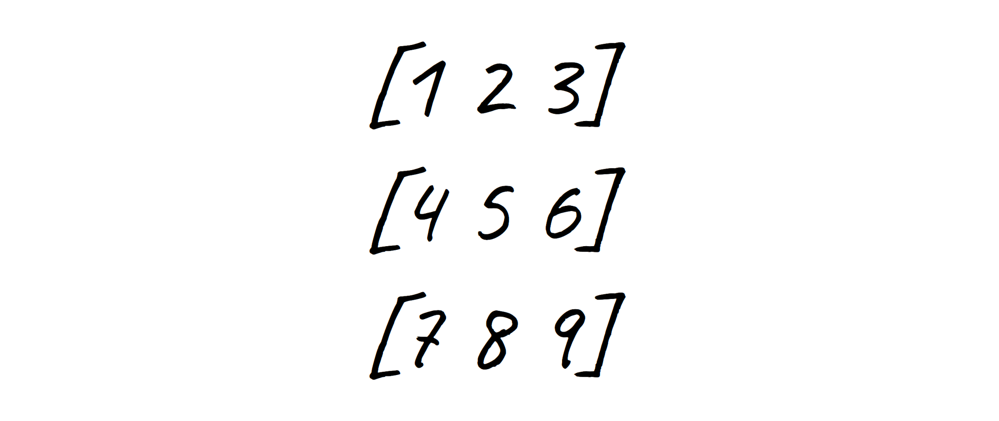

# Rectangular Array JS

Math operations with Rectangular Array (Matrix) in JavaScript.

## Install

In the browser just load the file `rectangular-array.js` in a `script` tag at the bottom of its `body`.

```html
<body>
    ...
    <script src="rectangular-array.js">
    <!-- your scripts using rectangular-array.js here -->
</body>
```

In node just install the package `rectangular-array.js` and require (or import) it in your module.

```sh
$ npm i rectangular-array.js
```

```js
var RectangularArray = require('rectangular-array.js');

// or import it (e.g. in React, Vue... whatever)
import RectangularArray from 'rectangular-array.js';
```

## Use

Demo code:

```js
// initialize from a literal matrix
var matrix = RectangularArray([[1, 2, 3], [4, 5, 6]]);

// print it on the console
console.log(matrix.toString());
// [1	2	3]
// [4	5	6]

// retrieve column index 0
console.log(matrix.col(0));
// [1, 4]

// retrieve row index 0
console.log(matrix.row(0));
// [1, 2, 3]

// create a new matrix by transposing the original into it and print it on the console
console.log(matrix.transpose().toString());
// [1	4]
// [2	5]
// [3	6]

// set row values at index 2
console.log(matrix.row(2, [7, 8, 9]));

// print it on the console
console.log(matrix.toString());
// [1	2	3]
// [4	5	6]
// [7	8	9]

// set column values at index 3 (add a new column if not already existing)
console.log(matrix.col(3, [10, 10, 10]));

// print it on the console
console.log(matrix.toString());
// [1	2	3	10]
// [4	5	6	10]
// [7	8	9	10]

// instantiates a new matrix with no elements and no dimensions (fully empty)
var matrix2 = RectangularArray();

// print it on the console
console.log(matrix2.toString());
// []

// fill it with values from previous matrix
matrix2.fill(matrix);

// print it on the console
console.log(matrix2.toString());
// [1	2	3	10]
// [4	5	6	10]
// [7	8	9	10]

// instantiates a new matrix with no elements but dimensions (fully empty too)
var matrix3 = RectangularArray(7, 5);

// print it on the console
console.log(matrix3.toString());
// [				]
// [				]
// [				]
// [				]
// [				]
// [				]
// [				]

// set value at row 10, column 10
matrix.val(10, 10, 123)

// print it on the console
console.log(matrix.toString())
// [1	2	3	10	 	 	 	 	 	 	 ]
// [4	5	6	10	 	 	 	 	 	 	 ]
// [7	8	9	10	 	 	 	 	 	 	 ]
// [ 	 	 	 	 	 	 	 	 	 	 ]
// [ 	 	 	 	 	 	 	 	 	 	 ]
// [ 	 	 	 	 	 	 	 	 	 	 ]
// [ 	 	 	 	 	 	 	 	 	 	 ]
// [ 	 	 	 	 	 	 	 	 	 	 ]
// [ 	 	 	 	 	 	 	 	 	 	 ]
// [ 	 	 	 	 	 	 	 	 	 	 ]
// [ 	 	 	 	 	 	 	 	 	 	123]

// get value from row 10, column 10
console.log(matrix.val(10, 10))
// 123
```